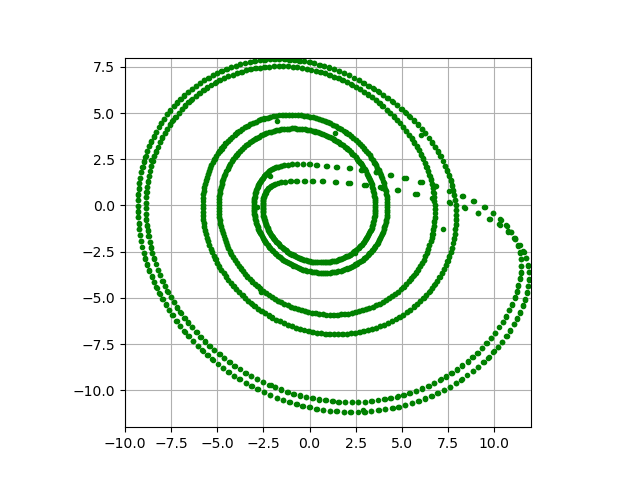
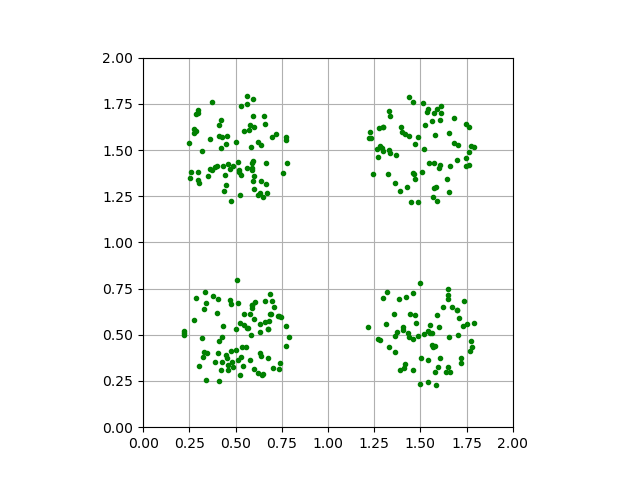
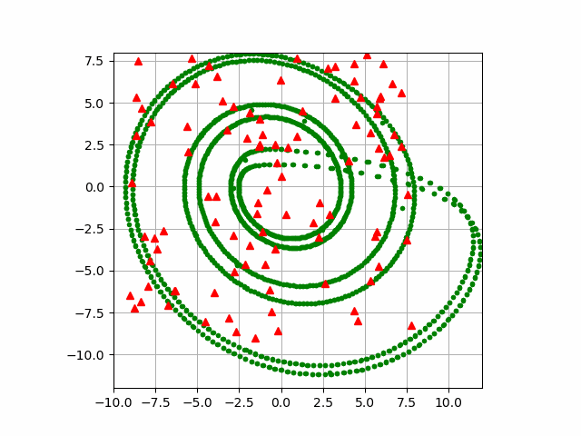
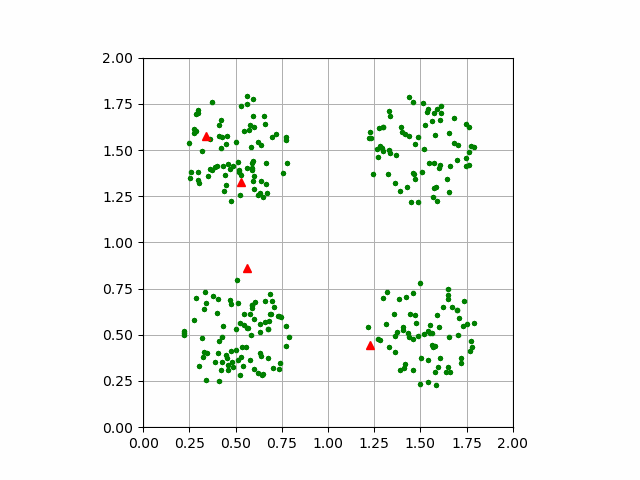
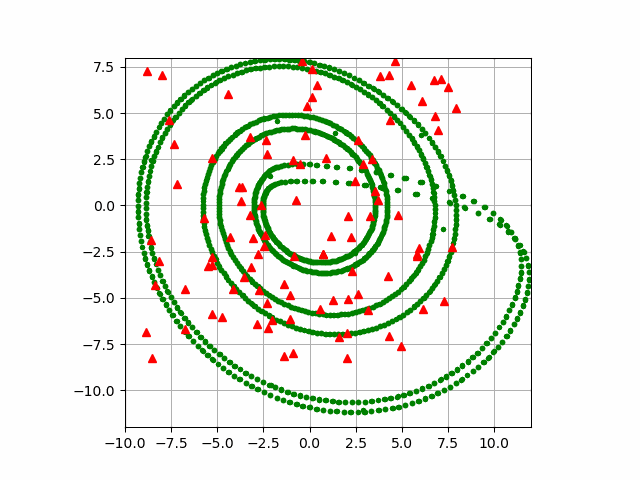
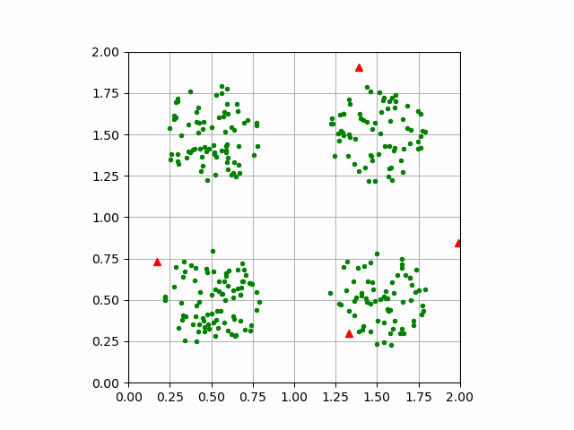
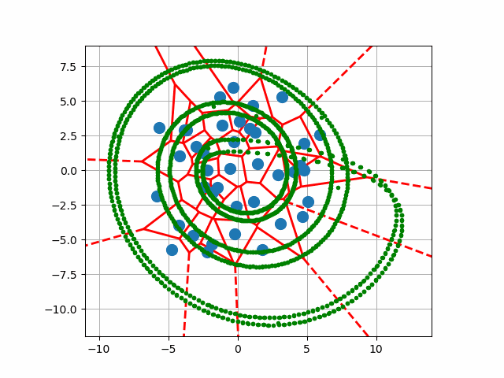
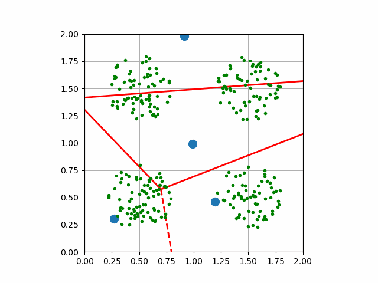

# AI-Quantization

Objective
===========

Implement ***Kohonen network***, ***neural gas*** and ***k-means clustering*** in order to quantize/classify data. 

Experiments and results
=====================

**Testing data:**

 

Kohonen network
-----------------

 

***Kohonen network*** is fine. There isn't any dead neurons (special repairing system).

Neural gas
-------------------------

 

As you can see ***neural gas*** work correctly. In my opinion it works better than ***Kohonen's algorithm***.

k-means clustering
-------------------
 

***K-means algorithm*** works as good as others. It do his job easy and fast.

Conclusions
=======

All of these algorithms work very well and very fast (Most of the runtime is spend on drawing plots).
Also all of theme were easy to implement (they are similar).

